# RPi Network Monitor

A production-quality **embedded Linux telemetry stack** for the Raspberry Pi that continuously monitors network interfaces, drives a deterministic link-state FSM, and serves a live web dashboard — all packaged as a Yocto BitBake recipe.

## Architecture



```
┌──────────────────────────────────────────────────────────┐
│              Raspberry Pi 3B (Yocto Kirkstone)           │
│                                                          │
│  ┌──────────────────────────────────────────────────┐    │
│  │         Linux kernel interfaces                  │    │
│  │  /proc/net/dev · netlink · sysfs · ethtool       │    │
│  └──────────────┬──────────────────────┬────────────┘    │
│                 │ poll 1 Hz            │                 │
│  ┌──────────────▼───────────┐          │                 │
│  │   C++ telemetry daemon   │          │                 │
│  │  • epoll event loop      │          │                 │
│  │  • Link FSM (5 states)   │          │                 │
│  │  • Lock-free ring buffer │          │                 │
│  │  • systemd service unit  │          │                 │
│  └──────────────┬───────────┘          │                 │
│                 │ UDP JSON             │                 │
│  ┌──────────────▼───────────┐          │                 │
│  │   Python Http bridge     │          │                 │
│  │  • WebSocket fan-out     │          │                 │
│  │  • REST /api/status      │          │                 │
│  │  • Rolling history       │          │                 │
│  └──────────────┬───────────┘          │                 │
│                 │ HTTP/WS              │                 │
│  ┌──────────────▼──────────────────────▼──────────────┐  │
│  │   Web dashboard  (Chart.js · live FSM · dark UI)   │  │
│  └────────────────────────────────────────────────────┘  │
└──────────────────────────────────────────────────────────┘
```

## Link State FSM

```
                  CARRIER_UP
  ┌─────────┐ ─────────────────► ┌─────────────┐
  │ UNKNOWN │                    │     UP       │
  └─────────┘ ◄──STABLE_TIMEOUT─ └──────┬──────┘
       │        ┌────────────────────────│───────────────────┐
       │        │              ERROR_RATE_HIGH                │
       │        │   ┌────────────────────▼──────────────┐    │
       │        │   │          DEGRADED                 │    │
       │        │   └──ERROR_RATE_OK──────────────────► ┘    │
       │        │              CARRIER_DOWN                   │
  CARRIER_DOWN  └──────────────────────────────────────────► │
       │                                                      │
       ▼                                                      │
  ┌─────────┐ ◄────────────────────────────────────────────── ┘
  │  DOWN   │
  └────┬────┘
       │ CARRIER_UP
       ▼
  ┌────────────┐
  │ RECOVERING │ ──STABLE_TIMEOUT──► UP
  └────────────┘ ──CARRIER_DOWN───► DOWN
                 ──ERROR_RATE_HIGH─► DEGRADED
```

## Project structure

```
rpi-net-monitor/
├── daemon/                    # C++17 telemetry daemon
│   ├── include/
│   │   ├── link_fsm.hpp       # 5-state link FSM
│   │   ├── proc_net_reader.hpp# /proc/net/dev parser
│   │   ├── ring_buffer.hpp    # Lock-free SPSC ring buffer
│   │   └── udp_publisher.hpp  # UDP JSON serialiser
│   ├── src/
│   │   ├── link_fsm.cpp
│   │   ├── proc_net_reader.cpp
│   │   ├── udp_publisher.cpp
│   │   └── main.cpp           # epoll loop, signalfd, threads
│   ├── tests/
│   │   ├── test_link_fsm.cpp  # GTest — full transition table
│   │   └── test_ring_buffer.cpp# GTest — SPSC stress test
│   └── CMakeLists.txt
├── bridge/
│   ├── bridge.py              # FastAPI + async UDP listener
│   └── requirements.txt
├── webui/
│   └── index.html             # Single-file dark dashboard
|── yocto/
    └── meta-rpi-net-monitor/
        ├── conf/layer.conf
        └── recipes-netmon/rpi-net-monitor/
            ├── rpi-net-monitor-daemon_1.0.bb
            ├── rpi-net-monitor-bridge_1.0.bb
            └── files/
                ├── netmon.service
                └── netmon-bridge.service

```

## Build (host / dev machine)

### C++ daemon

```bash
cmake -S daemon -B build -DCMAKE_BUILD_TYPE=Release
cmake --build build --parallel
# With unit tests:
cmake -S daemon -B build -DCMAKE_BUILD_TYPE=Debug -DBUILD_TESTS=ON
cmake --build build --parallel && ctest --test-dir build -V
```

### Python bridge

```bash
cd bridge
pip install -r requirements.txt
```

Dashboard: http://localhost:8080

## Cross-compile for Raspberry Pi (Yocto)

```bash
# 1. Add meta-rpi-netmon to bblayers.conf
bitbake-layers add-layer path/to/meta-rpi-netmon

# 2. Add to IMAGE_INSTALL in local.conf
IMAGE_INSTALL:append = " rpi-net-monitor-daemon rpi-net-monitor-bridge"

# 3. Build
bitbake core-image-minimal
```

Both systemd services start automatically on boot.

## Key design decisions

| Decision | Rationale |
|---|---|
| `epoll` + `signalfd` in `main()` | Clean, race-free signal handling without `volatile sig_atomic_t` hacks |
| Lock-free SPSC ring buffer | Zero mutex overhead between poller and IPC threads |
| UDP for C++ → Python IPC | Decouples languages; Python can restart independently |
| `/proc/net/dev` polling | No kernel module required; works on any Linux 2.6+ |
| HTTP + asyncio | Single-threaded but handles many WS clients concurrently |
| Yocto `useradd` class | Daemon runs as unprivileged `netmon` user |

## Demo

https://github.com/user-attachments/assets/d2c93ed0-d128-4af0-95ca-c463189d712b

## Maintainer

- Mahmoud Elkot
- mahmoudalielkot@gmail.com

## License

MIT
